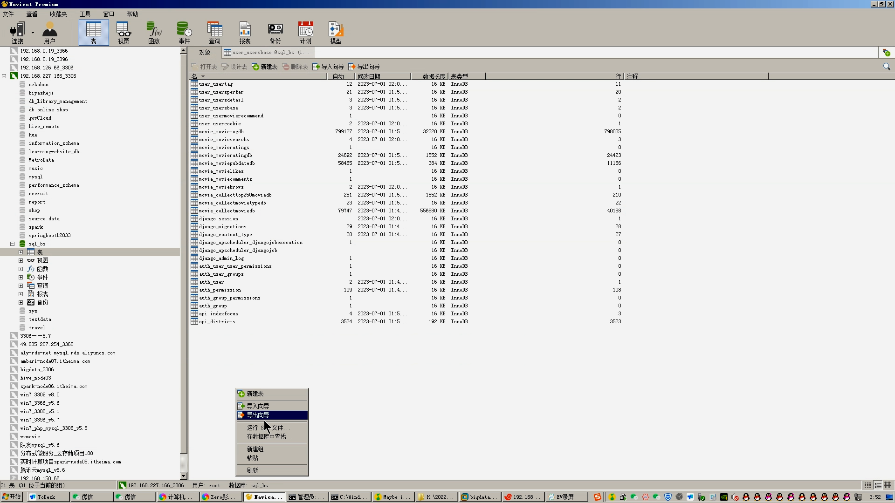
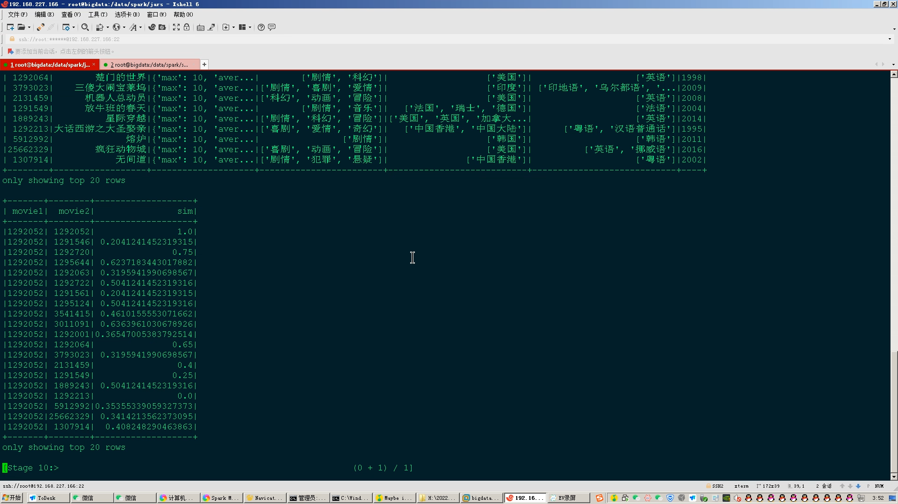

## 计算机毕业设计吊打导师PySpark+Hadoop知识图谱电影推荐系统 Django电影推荐系统 用户画像电影推荐系统 电影数据分析 电影可视化 电影爬虫 电影大数据 大数据毕业设计 大数据毕设 机器学习 

## 要求
### 源码有偿！一套(论文 PPT 源码+sql脚本+教程)

演示视频

https://www.bilibili.com/video/BV1Vs4y1k7a7/?spm_id_from=333.999.0.0

### 
### 加好友前帮忙start一下，并备注github有偿PySpark电影
### 我的QQ号是2827724252或者798059319或者 1679232425或者微信:bysj2023nb

# 

### 加qq好友说明（被部分 网友整得心力交瘁）：
    1.加好友务必按照格式备注
    2.避免浪费各自的时间！
    3.当“客服”不容易，repo 主是体面人，不爆粗，性格好，文明人。

本系统为我的本科毕业设计项目，毕设题目为“基于用户画像的电影推荐系统的设计与实现”。

本系统是以Django作为基础框架，采用MTV模式，数据库使用MongoDB、MySQL和Redis，以从豆瓣平台爬取的电影数据作为基础数据源，主要基于用户的基本信息和使用操作记录等行为信息来开发用户标签，并使用Hadoop、Spark大数据组件进行分析和处理的推荐系统。管理系统使用的是Django自带的管理系统，并使用simpleui进行了美化。

# 开发技术
django
python爬虫
pyspark
als推荐算法
协同过滤推荐算法
hadoop
mysql
邮箱技术

# 特色/创新点
实时计算+离线计算双实现
机器学习/深度学习推荐模型
大数据技术
分布式计算
爬虫
SparkML机器学习模块
...10-20种创新点

# 运行截图

# 运行视频(B站)

https://www.bilibili.com/video/BV1Vs4y1k7a7/?spm_id_from=333.999.0.0

